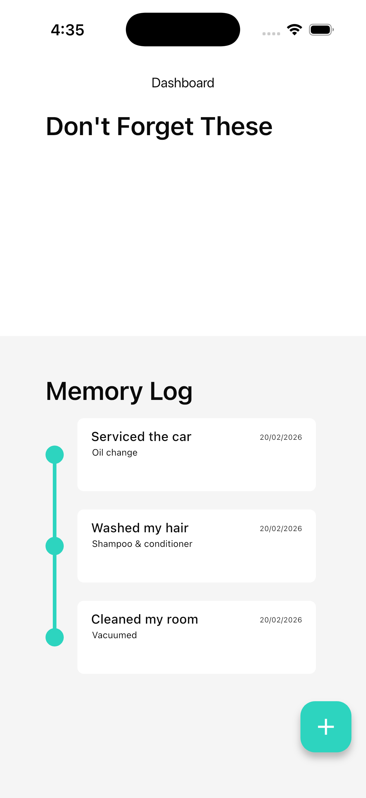
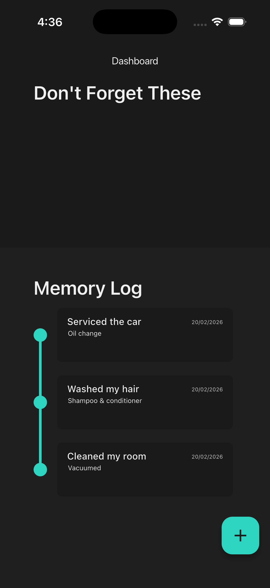
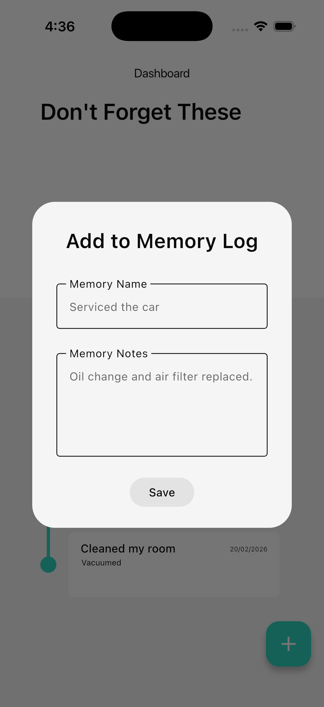
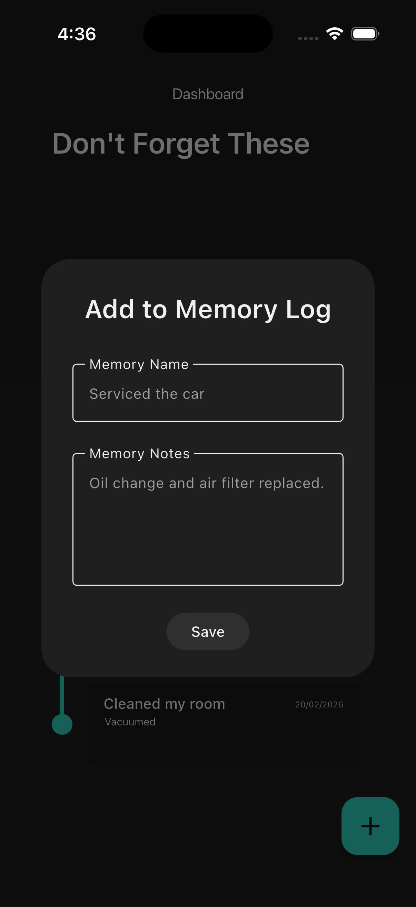

# MemoryStack

⚠️ NOTE: This project is for learning purposes

MemoryStack is a personal Flutter project I’m building while learning how to code.
The goal of this app is to experiment with Flutter UI, state management, and local storage — not to be production-ready.

The code may be messy, incomplete, or not follow best practices yet.
I’ve paused work on this project for now, and I’ll come back to it later once I’ve learned more.

---

## Description

MemoryStack is a personal timeline of the last time you did important things.

It’s designed to help you log memories or reminders like:
- Serviced the car
- Replaced a filter
- Completed a task you don’t want to forget

Each memory is stored locally and displayed in a timeline-style UI.

---

## Current Features

- Add memories (name + description)
- Memory creation via dialog modal
- Delete memories using swipe actions (flutter_slidable)
- Local persistence using SQLite (sqflite)
- Timeline-style layout using timeline_tile
- Light & Dark mode (follows system theme)

---

## Tech / Concepts Practiced

- Flutter widget composition
- StatefulWidget vs StatelessWidget
- Passing callbacks between widgets
- Local storage with SQLite (sqflite)
- Basic app structure and file organization
- Custom theming (light / dark mode)
- Rebuilding UI after database changes

---

## Known Limitations

- No edit memory feature
- Dates are currently hardcoded
- No sorting or grouping
- UI/UX still rough
- App architecture will likely change later
- No cloud sync or backup
- Don't forget about these... doesnt do anything

This project is currently paused and will be revisited in the future.

---

## Screenshots

